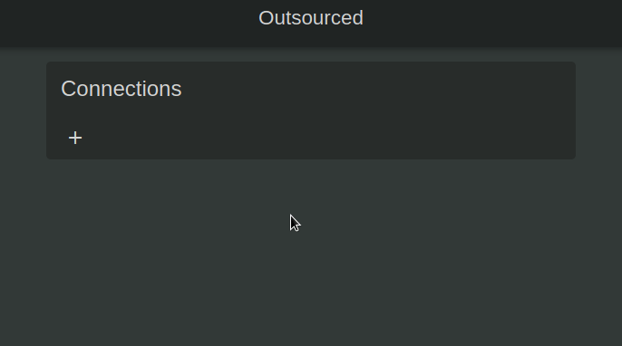
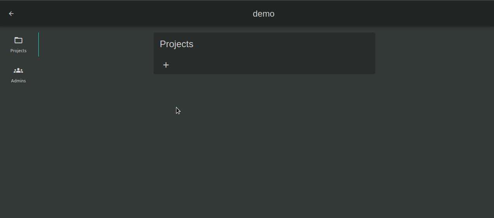
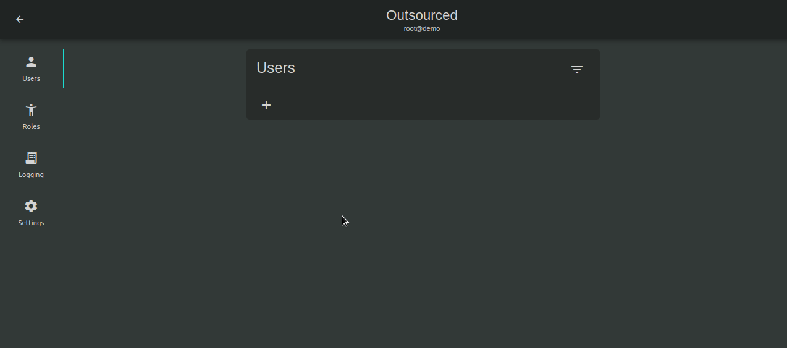
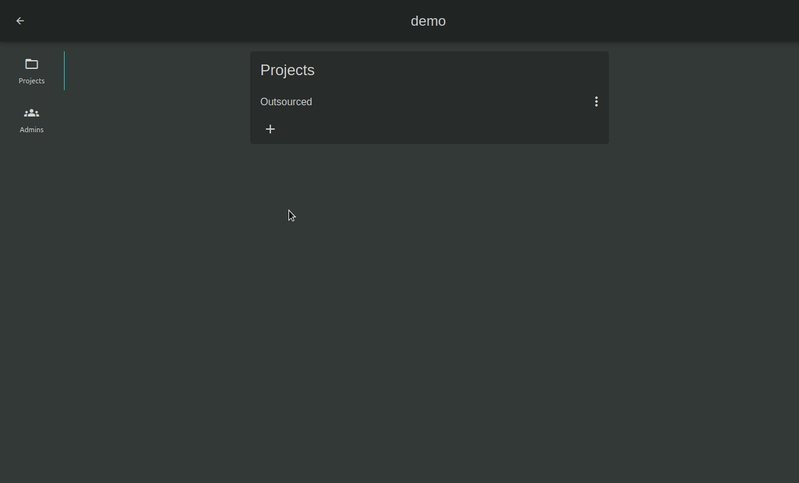
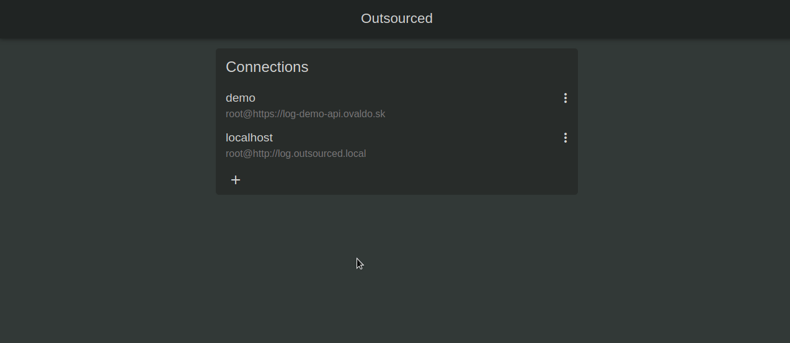

# Outsourced Web Client

Web client for [Outsourced API](https://github.com/pipan/log-outsourced-api)

[web client URL](https://outsourced.ovaldo.sk)

## Demo

Create [new connection](#connection) to the demo server with these credentials.

* Name: demo
* Host: https://log-demo-api.ovaldo.sk
* Username: root
* Password: root

## Usage

This section will guide you trou every aspect of your outsourced server. We hope, this guide will show you full potential of this service.

### Connection

To be able to make any changes on your outsourced server, you have to establish a connection to that server first. Connections are stored in browser storage and we are not storing your passwords or access keys in any storage other then RAM. It means, you have to insert your password every time you wawnt to connect to your server. This decision was made to increase security by decreasing usability. You can still use remember password if you want to.

### Projects

One server can service multiple projects. Every project has it's ovn configuration. All you have to do is, input a project name and you can start setting it up. You don't have to set up every feature in your project to start using it. If you want to use only logging, you can use only that part. Logging and permissions are separated so that they won't affect each other.

### Access Keys

Well, there is one thing you will have to set up every time you create a new project. You'll need an `access key`, that will allow communication with your server, and specificaly this project, from your application. Go to `Settings` inside you project. Select `Access Keys` and then create an access key. Pick a suitable name for this key, so you can remember who uses this key. A good rule of thumb is to use an `environment name` or `machine name` that will use this key.

### Set Logging Rules

You decided to use outsourced server for logging. Good. Logging section enables you to change how your application's logs are handled. You can start by logging everything to `file` or `database`. Latter you may want to use some other service (like `kibana` or `sentry`). To make this chnage, you don't have to add libraries to your application or change code in your application. Just change handler in outsourced server and your logs will be imidiatly be send to the correct handler.

You can also choose different handlers for different log levels. You can also have multiple handlers for one level. It's up to you. In this example, we want to store low level logs in `file` and high level logs in `redis`.

### Administrators

Latter on, you may want to grant access to the server to more people. We call these users administrators. Administrators have access to all project on the server.

You can create an administrator when you connect to the server and select `Administrators`. After picking a username for administrator, you have to send this person an invite link. This link can be generated by selecting `more options` next to administrator row and selecting `Copy invite URL`.

Invite URL enables a user to pick a new password for their account. Only they will know their password during the whole process. Invite link becomes invalid after finnishing registration (by selecting password) or by removing administrator.

## Installation

### Download

1. Download the [latest release](https://github.com/pipan/log-outsourced-ui/releases/download/v0.2.2/outsourced-v0.2.2.zip)
2. create [virtual host](docs/VIRTUAL_HOSTS.md)

## Contribution

1. clone repository
2. make changes
3. create pull request
